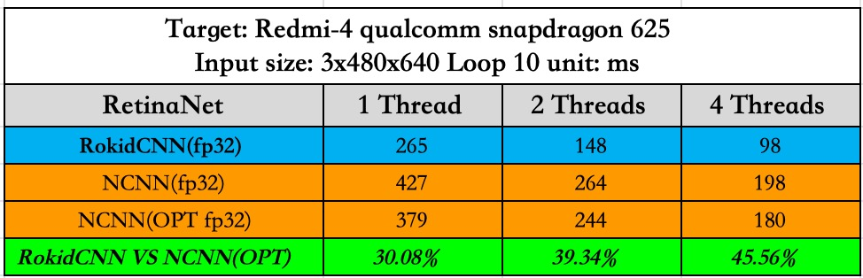

# RetinaFace-Cpp
RetinaFace detector with C++

[official RetinaFace](https://github.com/deepinsight/insightface/tree/master/RetinaFace)

I convert [mobilenet-0.25 mxnet model](https://github.com/deepinsight/insightface/issues/669) (trained by [yangfly](https://github.com/yangfly)) to [caffe model](./convert_models/mnet)

I convert R50 mxnet model to caffe model [BaiDuYun](链接:https://pan.baidu.com/s/1jTZ2fcaIuUiPrzHUH-LWgQ)密码:6evh | [Google Drive](https://drive.google.com/drive/folders/1hA5x3jCYFdja3PXLl9EcmucipRmVAj3W?usp=sharing)

* I have checked the output of the two models be the same.

* For same input images, the output of the two detector (python version and cpp version) is same.

(the code is too simple, only for reference 23333)

### This is anchor parsing demo, NO INFERENCE, you should replace your own inference header and code (caffe/ncnn/feather .etc) in the source code

I create QQ group: 760688309 for communicating

------

## Update 2019.6.4
I update time [test tools](./SpeedTest/) for ncnn and rokidnn, only arm64-v8a version (I'm too lazy to compile armeabi-v7a version, if you need, I can update later)

**how to run**

use adb push to device and run
./retina_det imagepath modelpath thread_num loop_num

It will calculate average time (including input time, forward time and anchor parsing time, nms time)
the output image is saved as "res.jpg"

## Time Benchmark

VGA (640x480)

**RokidNN vs NCNN**

Next week I will provide apk built with NCNN and RokidNN for you to compare.

| platform | net | threads 1/2/4(ms) | inference |
| ------ | ------ | ------ | ------ |
| qcom625 | mnet | 418/262/202 | NCNN |
| qcom625 | mnet | 379/244/180 | [NCNN(optmize)](https://github.com/Charrin/RetinaFace-Cpp/issues/3) |
| qcom835 | mnet | 137.37/82.97/62.79 by [hanson-young](https://github.com/Charrin/RetinaFace-Cpp/issues/3) | NCNN |
| qcom835 | mnet | 125.10/74.52/75.09 by [hanson-young](https://github.com/Charrin/RetinaFace-Cpp/issues/3) | NCNN(optmize) |

------

## Update 2019.5.28
R50:
Because of the GPU memory limited, I set max(width, height) to 1000 and test it on WiderFace_val set for **SINGLE SCALE, NO MULTI-SCALE, NO FLIP**, results as follows:

| wider val | easy | medium | hard |
| ------ | ------ | ------ | ------ |
| python version | 92.25 | 88.86 | 64.02 |
| cpp version | 91.36 | 87.15 | 62.22 |

## Update 2019.5.27
mnet:
I test on WiderFace_val set for **SINGLE SCALE, NO MULTI-SCALE, NO FLIP**, results as follows:

| wider val | easy | medium | hard |
| ------ | ------ | ------ | ------ |
| python version | 83.28 | 77.02 | 39.52 |
| cpp version | 83.04 | 76.84 | 39.43 |

You can see the two detect results as **results/cpp_detect** and **results/python_detect**. The main cause of the difference in test results is the numerical precision difference between C++ and python.

## TODO
* implement bbox_vote
* multi-scale test
* speed benchmark (CPU/ARM)
* new models
